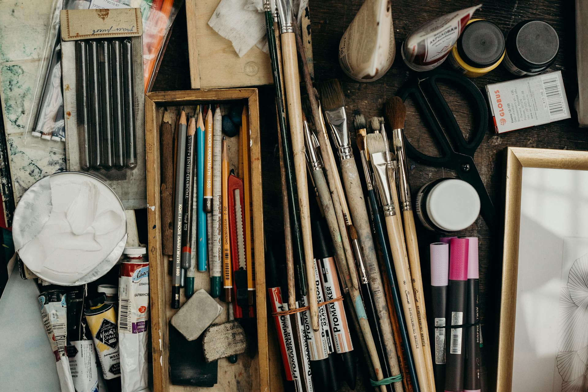

# Bandarra_Sydney_FIP_Portfolio_Website
This is a GitHub Repositiory for IDP3 Interactive Media Design, Year 2 Semester 3, F25 Final Integrated Project. This project is a portfolio website build.
# The Portfolio of Syd Bandarra - Multimedia Creative

Welcome to my portfolio website repository. This repo holds a variety of projects that showcase my skills and experience across multiple media feilds. Navigate my projects by type!
This repository is intended for versioning, and GitHub best practices.

## Table of Contents  
[About](#about) 
[Skills](#skills) 
[Languages](#languages) 
[Features](#features) 
[Installation](#installation) 
[Contact](#contact) 

## About 
This portfolio was created for the Final Integrated Project for IDP3 Interactive Media Design, Yr2 Sem3 F25. The objective of this assignment is to create a responsive and engaging user optimized portfolio website that showcases a varity of student work.

## Skills 
Here’s a quick overview of the skills highlighted in this portfolio:

### Languages: 
JavaScript, HTML5, CSS3
### Frameworks and Libraries: 
Vue.js, GreenSock
### Tools: 
Git, Adobe Suite
### Technologies: 
RESTful APIs, Responsive Design,   

## Features 
  ⚡️ Fully Responsive
  ⚡️ Valid HTML5 & CSS3
  ⚡️ GreenSock Animations

## Installation 
To run the portfolio locally:

- Clone this repository
- Navigate into the project directory:
- Open the index.html file in your browser, or if using a local server, start the server and navigate to localhost to view.

## Contact 
Feel free to reach out if you’d like to collaborate or have any questions!

Email: s_bandarra@fanshaweonline.ca

Thank you for visiting my portfolio!AJAX